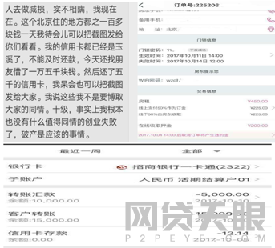
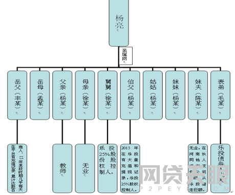

雷友__骗子王__又发帖了，原帖被删，[转帖内容](http://www.p2peye.com/thread-1907348-1-1.html)如下：

> ### 乐投天下杨亮：一个彻头彻尾的行骗CEO
> 7天又过去了，上一篇我写到了《找杨亮要钱的五个理由》，没想到这7天过去，鉴于找他要钱理由太充分。杨亮就开始毫无底线的装穷了。见图1
> 
> 
> 
> 我只想说一句，杨亮先生，你既然这么光明磊落。你能把你上海工商银行的那张卡近三年的流水公布吗？你别问：“哪张卡？或没有这张卡”；就是王兵转你3千万的那张卡！！卡号我再报一遍：卡主 杨亮 卡号：6222021001077029087。  
> 这已经是我第三次在帖子中问这张卡的情况了，你从来不做任何回应！！既然光明磊落，为何不磊落一次给公众看一看？也请你再别用的你口头禅来回复公众：我现在有事，稍后回复大家；大家别急；大家别听信片面之词。。。。。。  
> 经过了这7天，发现找他要钱的理由又被挖掘出了很多。他已从一个疑似骗子演变成了一个彻头彻尾的骗子。  
> 杨亮在行骗的过程中可谓费尽心思，把乐投事件演绎成了一个局中局，套中套的复杂故事。但是，要想人不知除非己莫为。投友们继续挖出了他那些背后做过的难以启齿的丑事。  
> 十一小长假期间，投友们质疑他作为CEO，用自己的身份从平台借钱用为股票投资。他的回复是“帮别人借。”（见图1）。暂且我们不说这种行为作为CEO是否合法合规。我们接着往下看。
> 
>     
>                  
> 杨亮先生，你在任期间，所作所为几乎把乐投平台当做你自己家的印钞机了。我们再看看下图（图3）。
>   
> 
>           
> 以上10人，目前发掘的除了丰某和毛某两人没有从平台借款之外，其余8人全部在平台借过钱。  
> 这其中，很多借款是没有抵押物的，很多人也是不具备借款资质，甚至是没有借款理由的。到底是一种什么样的力量让杨亮能肆无忌惮，无法无天的将我们投资者的钱借给他这些至亲的人。  
> 杨亮把钱借给自己炒股，解释说是帮别人借，那这些人频繁从平台弄钱，还是帮别人借吗？别用同样的理由唐塞！编好再说。  
> 你这些行径投友们只能说是触目惊心，无法无天，胆大包天！！！  
> 放心，你的自融标远远不止这一些，这只是冰山一角！！！你犯下的滔天大罪必将昭然天下，你的丑行与虚伪也将被一一揭开，逃得过初一，你必过不了十五。装可怜一点都不好玩！投资者的血汗钱不是这么容易骗到手的！依法治国必将坚持下去，你只有主动交代，主动赎罪才是出路！！！
