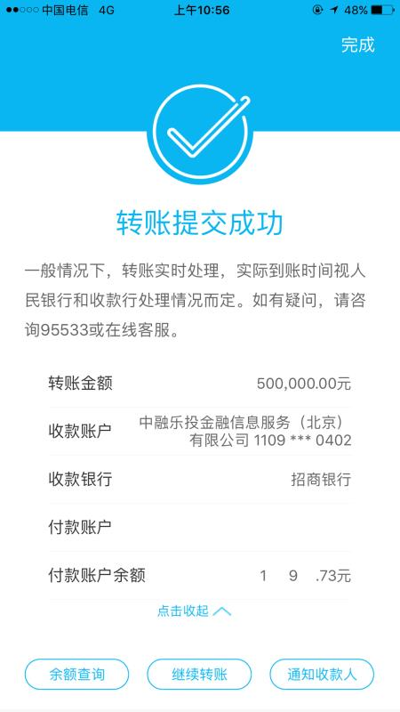
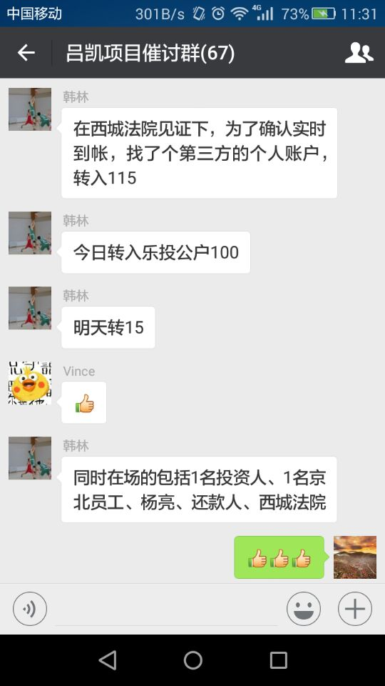

据悉，2017年10月18日，在北京市西城区法院、借款人代表、京北投资代表、催款小组等人见证下，催款小组已将催讨回的__100万__欠款转账倒公管账户，本次主导者为__翰林__。

杨亮虽然组织了追款小组，但是在催讨环节表现消极，不配合，且要帐能力很差。这些本该乐投做的事情，都让投资者做了。杨亮是否可耻？

另外，催讨是正常行为，那些欠债的不要以为乐投倒了就不用还钱了。

还有，乐投暴雷事件损失资金大头都在王兵及其团伙自融，大家要谨记。

下面附图：

