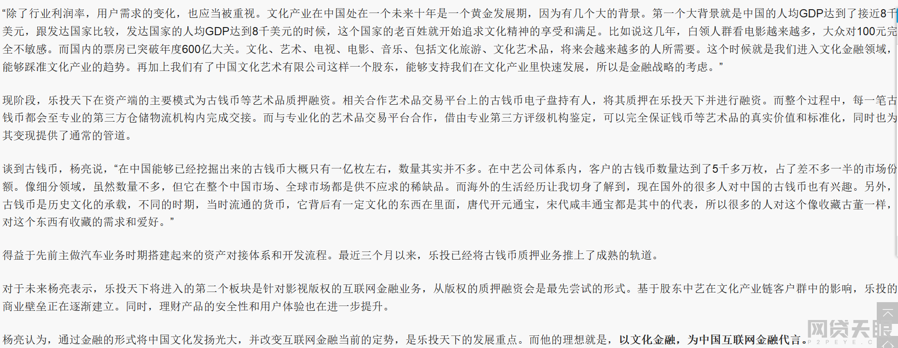

雷友__骗子王__再次于[网贷天眼](http://www.p2peye.com)平台发帖，但是很快被删。以下为原文：

> 上一篇帖子写到了杨亮涉及亲属的自融标等问题，这是铁证如山的东西。但是发出来后，很遗憾被网站删除，热心网友又帮我贴出来了，总算没有百忙。  
我要感谢这位热心网友。近日我们乐投的维权主要焦点集中在维权的方向上，还因此发起了很大的争论，甚至是骂战。  
> 其实我觉得这大可不必，乐投的维权肯定需要团结，需要一个正确且行之有效的维权方案。我们不可一味的寄希望于骗子的催收，也不能单纯的沉迷于寻找证据。我们必须要双管齐下，毕竟，最后我们是为了回款，回更多的款，甚至是全款。  
> 不管怎样，从回款角度出发，我又想到了几个新问题
> 
> 第一，是如何回款？从哪里能回款的问题？杨亮的催收状况我们都在注视，但是我们可以预料得到未来的催收结果，当前快两个月，回了100多万，占待收9000万的1.5%，按此速度，预计两年之后，能不能达到10%？是一个很大的问号。但即使这样，绝对不会令我们投资者满意。所以，这里就涉及到一个回款的钱从哪里来的问题？
> 
> 1. 杨亮不能仅仅局限于减损层面。大家看到了他的催收能力，也能预期到催收能带来的最后效果。杨亮口口声声说他没拿乐透一分钱，这句话我先不去追究。但你承认你糟蹋了我们投资者的钱吗？你承认把我们投资者的钱从有变成无码？惊天的坏账和惊天的自融标，你应该负全责！这句话过分吗？一张所谓的卖坑协议丢给王兵，王兵负责这些大坑，你就可以心安理得了吗？不是我们故意找你茬，是你确实得对这近7千万的坏账负责，你得想减损以外的办法，因为所谓减损回来的钱确实太少太少。再说了，这些钱根本不是你口袋里面的钱！！投资者很不满意。
> 2. 找王兵回钱。目前来看，王兵被抓，资产被封已是事实。因而王翻不了身，他那边的资产基本都在警方掌握之中。
> 
> 第二，杨亮是如何被王兵骗的？笔者近日才发现王兵的所谓汉唐艺术品交易所（[http://www.htcae.com/](http://www.htcae.com/)）一直在正常运行。而王兵仅仅是该交易所的一名高管。到这里，我不禁要佩服杨亮的金融嗅觉。堂堂清华CEO，能被一个小小交易所的高管冒充有着数十亿的雄厚实力的国资背景骗到手？真是笑掉了大牙。不过，一个负债数千万的烂摊子，居然卖出了好价钱，杨亮心里是喜是忧？“周瑜打黄盖”的故事告诉了我们什么，大家自己去想。
> 
> 第三，杨亮到底懂不懂文化标？到底有没有参与文化自融标？2017月3月，杨亮在多个论坛场合或是接受采访的时候，大谈特谈文化标和古钱币，一副文化标专家的样子。下面是杨亮今年三月接受《华夏金融家》杂志特约记者央视主持人李燕采访的语录原文：
> 
> >         【“除了行业利润率，用户需求的变化，也应当被重视。文化产业在中国处在一个未来十年是一个黄金发展期，因为有几个大的背景。第一个大背景就是中国的人均GDP达到了接近8千美元，跟发达国家比较，发达国家的人均GDP达到8千美元的时候，这个国家的老百姓就开始追求文化精神的享受和满足。比如说这几年，白领人群看电影越来越多，大众对100元完全不敏感。而国内的票房已突破年度600亿大关。文化、艺术、电视、电影、音乐、包括文化旅游、文化艺术品，将来会越来越多的人所需要。这个时候就是我们进入文化金融领域，能够踩准文化产业的趋势。再加上我们有了中国文化艺术有限公司这样一个股东，能够支持我们在文化产业里快速发展，所以是金融战略的考虑。”
> >      现阶段，乐投天下在资产端的主要模式为古钱币等艺术品质押融资。相关合作艺术品交易平台上的古钱币电子盘持有人，将其质押在乐投天下并进行融资。而整个过程中，每一笔古钱币都会至专业的第三方仓储物流机构内完成交接。而与专业化的艺术品交易平台合作，借由专业第三方评级机构鉴定，可以完全保证钱币等艺术品的真实价值和标准化，同时也为其变现提供了通常的管道。
> >        谈到古钱币，杨亮说，“在中国能够已经挖掘出来的古钱币大概只有一亿枚左右，数量其实并不多。在中艺公司体系内，客户的古钱币数量达到了5千多万枚，占了差不多一半的市场份额。像细分领域，虽然数量不多，但它在整个中国市场、全球市场都是供不应求的稀缺品。而海外的生活经历让我切身了解到，现在国外的很多人对中国的古钱币也有兴趣。另外，古钱币是历史文化的承载，不同的时期，当时流通的货币，它背后有一定文化的东西在里面，唐代开元通宝，宋代咸丰通宝都是其中的代表，所以很多的人对这个像收藏古董一样，对这个东西有收藏的需求和爱好。”得益于先前主做汽车业务时期搭建起来的资产对接体系和开发流程。最近三个月以来，乐投已经将古钱币质押业务推上了成熟的轨道。
> >          对于未来杨亮表示，乐投天下将进入的第二个板块是针对影视版权的互联网金融业务，从版权的质押融资会是最先尝试的形式。基于股东中艺在文化产业链客户群中的影响，乐投的商业壁垒正在逐渐建立。同时，理财产品的安全性和用户体验也在进一步提升。
> >          杨亮认为，通过金融的形式将中国文化发扬光大，并改变互联网金融当前的定势，是乐投天下的发展重点。而他的理想就是，以文化金融，为中国互联网金融代言。】
> 
> 为此，希望广大投友擦亮眼睛，看看杨亮的言论。他口口声声说文化标与自己无关，是否真的无关？？这个需要广大投资者去查证。  
维权，即是为钱。在此呼吁广大乐投受害者团结起来，消除分歧，团结一致往前看，坚决将犯罪分子绳之以法，坚决将非法所得财归原主，以告慰那已疲惫的心灵。
> 
> 
