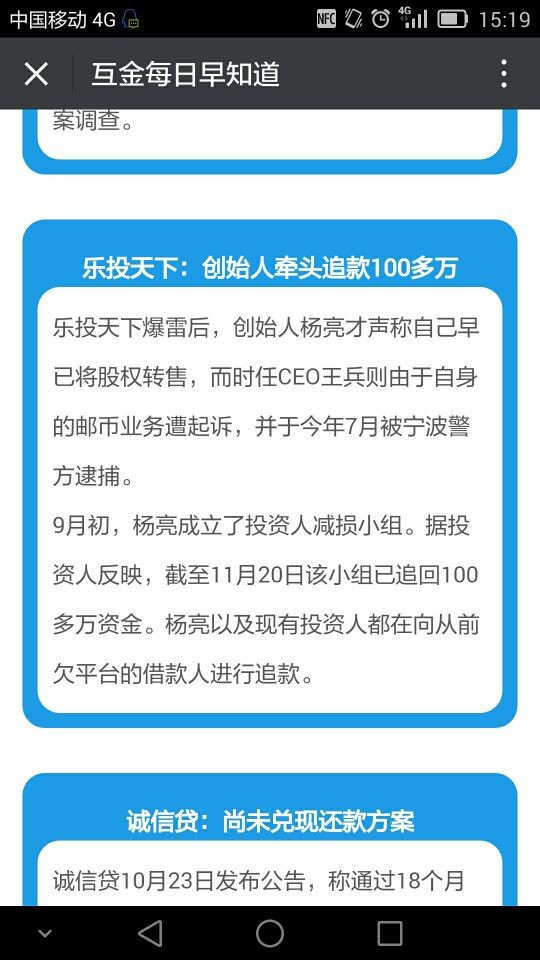

## 乐投黑化史之杨亮劣传
### ——纪乐投天下跑路即将跨年

---
时间犹如长河之奔逝，历史如同车轮在飞转，物欲横流之当下，人心不古之今天，仁义不古，道德日衰，信仰缺失，其谁无惑？
  
乐投天下CEO杨亮者，荆楚人氏也，少时辄以才思名乡野，学业惊四方，师言其乃青出于蓝而远胜于蓝，近百万考生之前数十，六十亿人高等教育之前百，训以乾坤才之三甲也！然人活一世草木一秋，居止一室食仅三餐，浩瀚长河之中惟有显名于世者乃得其名，大丈夫若无功业于世与蝼蚁何异？杨亮深以为然，远哉志向，昭然外现，鄂州人丰平深以为宝遂以掌珠之女丰婧妻之。

婚后某日，丰女以年薪百万之高级白领不足取，安可适其鸿鹄之志哉？遂从妻志辍职于高级投行而创业P2P乐投天下（天下人乐投之，故名。今视之，应是乐透天下，天下大乐透，十损其九）于中关村清华园，招商引资，宵衣旰食，夜以继日，与众同吃同住同甘共苦，时人皆谓其乃具才华胆识于一身，助乐投乐借名于世之具高学府、高智商、高学历之深具传奇色彩之CEO，时年三十出头。

或云：何为助投？曰：杨亮云乐投天下打娘胎便有高贵学府之基因，每宣传必浓墨重彩大书特书助众决于犹豫；何为助借？答：前有妻家母家，后有兄弟父族，前有失信被执行之老赖，后有借壳融资之王君顾大姐，真仁义无双而置专业所学事业于不顾，私德日隆不计众望而弃信众如敝履。

且众皆应识某日CEO杨之岳父丰平下榻杨家，言说筹买家屋周转生意尚缺钱数百万不等，于是丰老爷子便有了数百万钱；其兄弟毛某某某日约杨大CEO于饮中，数为生活创业惆怅者三，于是一毛而增为数百万根毛，如此种种，不一而足……其亲近之人亦有传其假标、自融、自废风控（此段所涉皆已证实，详询乐投天下联名QQ群），数年间，彼之乐投已是坏账百出，悄然由创业之鸿鹄急坠至好窃之家鼠，其何以至此哉？盖其稍借度支之权便可获利数千、数万、数十万、数百万，见美色而不动者千百年唯一柳下惠耳！（众言：夫妻店，真黑店。诚哉斯言！）其长期手淫乐投，意淫P2P，久淫成瘾，岂能不伤？由优等而入劣等，岂不令人痛惜哉！

会王兵借壳融资入主乐投之际，杨君本其助人为乐之精神帮人帮到底，送佛送至西，数度为王君之所谓文化金融站台、融资、宣传，如是坑害众信众再三，王君投桃报李未曾追究杨君前述种种之过……然杨有拘束而王无禁忌，邮币卡标的之大行其道令杨君惊恐不已，乃于八月中旬于其个人之朋友圈发离职声明（王杨君虽是战友，却非朋友，故王不得入杨朋友圈（莫怪古人有王杨不牢之说）而未知其违反私下协议——此为史君个人YY，自忖八九不离十）以为甩锅……

近日忽闻乐投创始人牵头追款100多万， “史君”闻之不由笑而涕下，其因如下：莫说100多万，便是杨亮手淫乐投之时中饱私囊（借假标、自融、所谓“坏账”——大量证据还需几百页方能到达战场，定位坐标详询乐投天下联名QQ群）之数额便有数千万之巨（具体数额公安、乐投天下联名QQ群皆有资料），此所谓“追回100多万”不正左手偷100右手掏1块乎？此其一也；其二，“追回”二字杨亮当得起否？此100多万大数皆借款人有还款之意愿而杨亮君人为设置路障乃医之好治不病以为功之劣等路数以彰其“追款”之难（有困难不上，没有困难创造困难再上，再次为其高智商点赞）；其三，即将跨年，所追回之数真乃百里挑一，回款结束则我辈皆垂垂老矣，尚能记否？

创业失败东山再起者比比皆是，奚为黑道直走而不弯哉？何必效楚霸王乌江自刎而自毁前程哉？何不重拾人生观与价值观，真正努力回款则众恕可得，何必创业败而又陷囹圄哉？须知，不义之财如流水，纵然绞尽脑汁得之其能守乎？人活一世草木一秋，居止一室食仅三餐，谋小利而失大利，求小德而失大德，岂不知积祸之家必有余殃，丧德至此，君不以无后为忧乎？纵有后，有此劣迹，后人纵不为意外所伤亦恐久活社会舆论，网络征讨之下，能康健长成乎？如皆否，君陷囹圄此不义财与君何关？他人又如何安然花之而不为外力所妨？为君计，学风久渐，民智已开，勿以聪明而为聪明误，全力配合信众挽回损失方为杨君走向幸福生活之康庄大道。

“史君”曰：执着一亮，羊（杨未能坚守创业初心，未能坚持企业规律制度）不如猪（诸葛一生伐魏，病逝五丈原）；锦绣前程，猪不如羊（今人多寿，重信用，名声，三十之年大有可为）。为今之计，惟有吐不义求众恕，救己远囹圄，回头方有归处，莫为聪明误。
